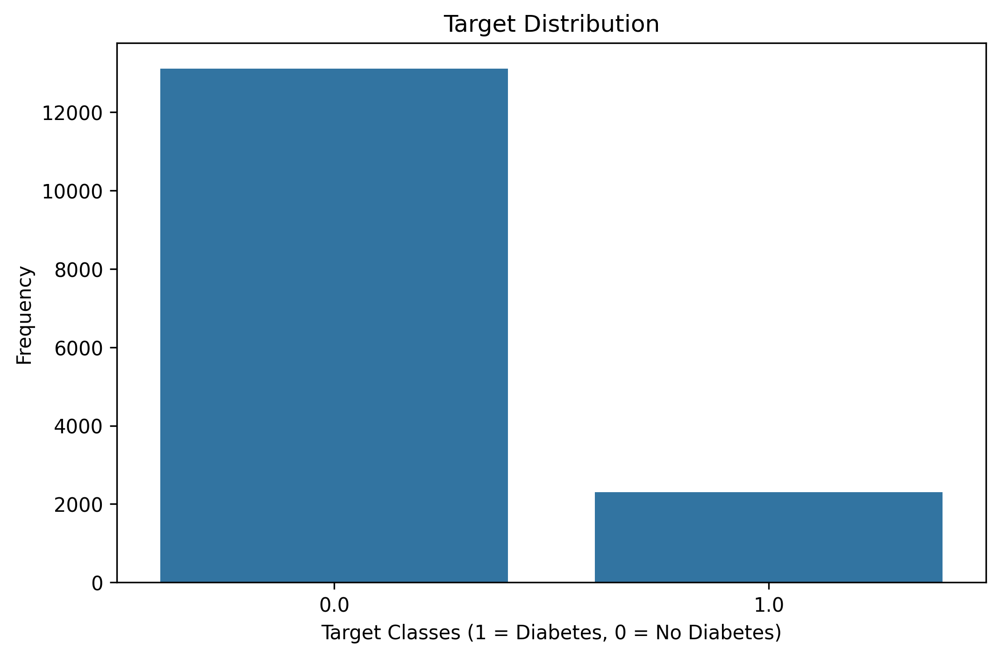
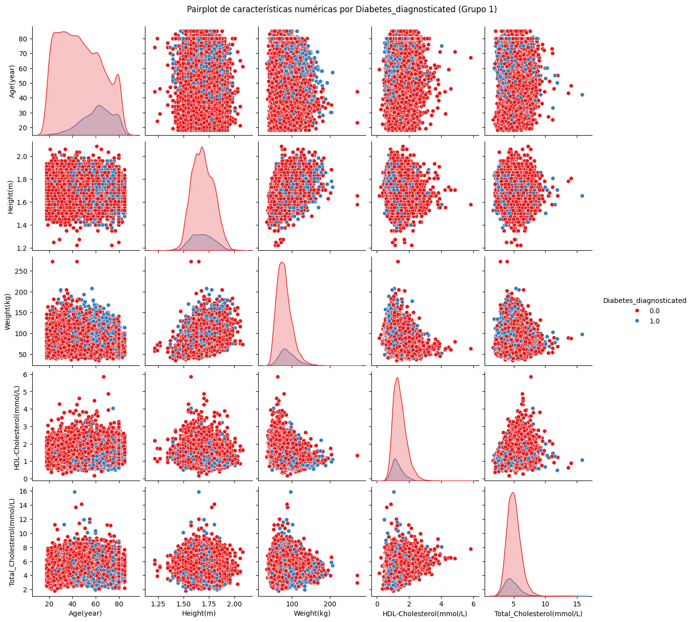
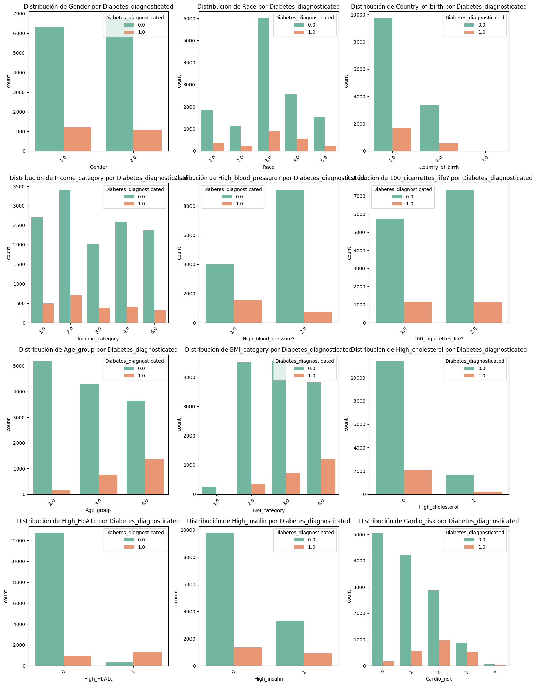
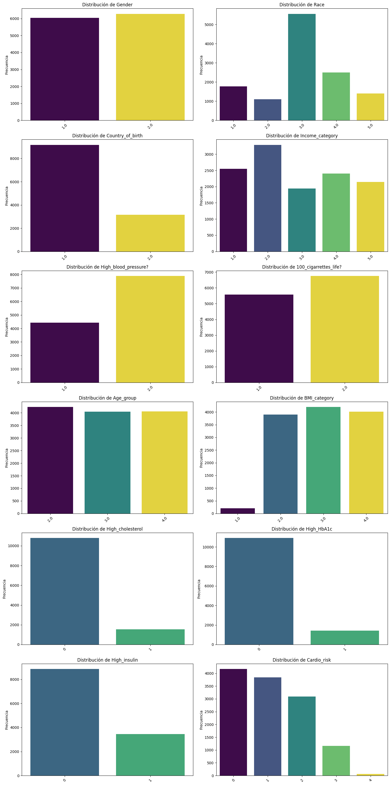
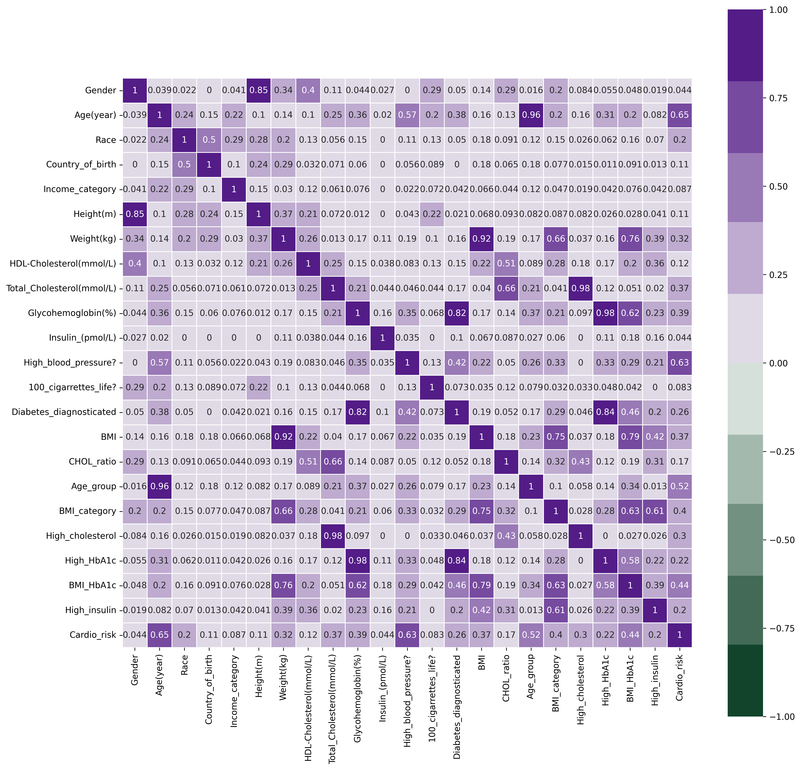
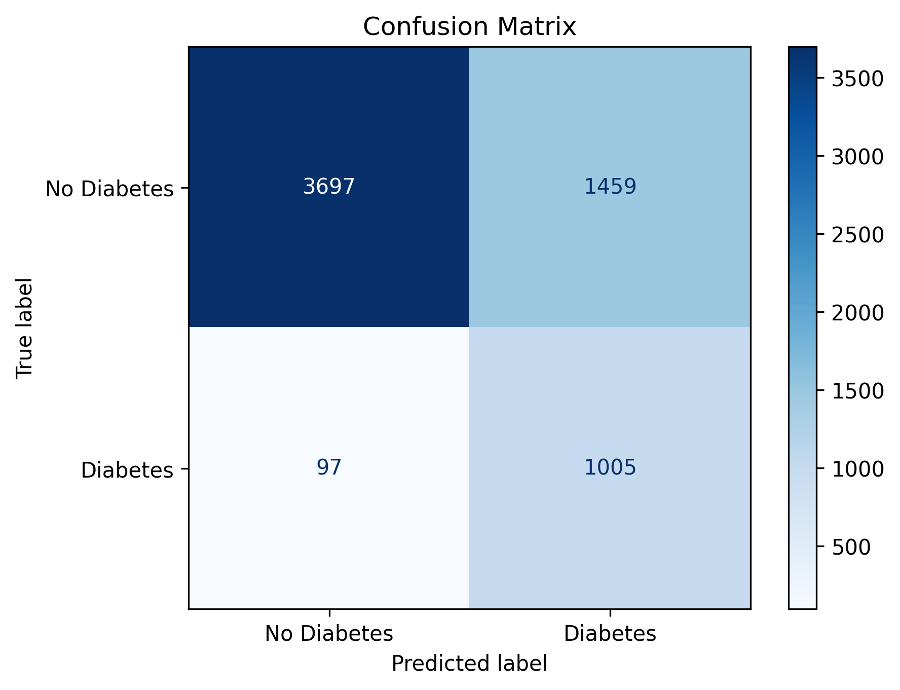
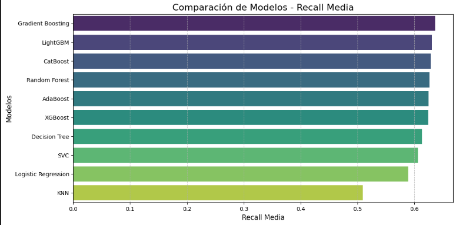
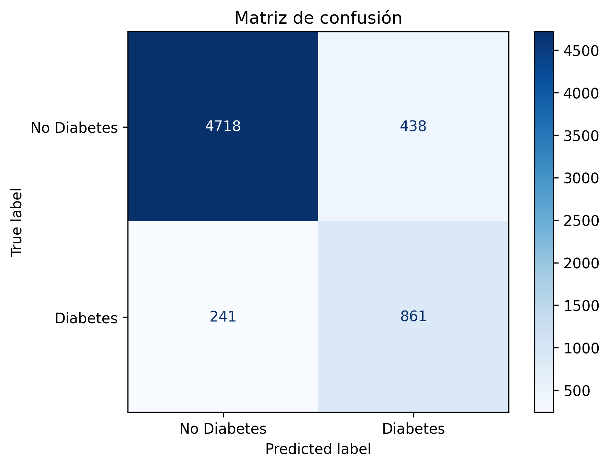

# 🩺 Diabetes Prediction Project (2017–2023)

This project explores and evaluates different machine learning models to predict the likelihood of diabetes in individuals, using health-related data from **2017 to 2023**. The goal is to build an accurate and interpretable pipeline that can be applied to real-world clinical screening contexts.

---

## 📂 Project Structure

- **Data**: Preprocessed clinical and sociodemographic data.
- **Notebook**: Final pipeline including EDA, model training, evaluation, and comparison.
- **Figures**: All relevant visualizations and plots used for analysis and reporting.
- **Models**: Neural Network and best ML model saved for inference.
- **Utils**: Scripts used for visualizations and evaluations, used as a toolbox 
---

## 🧼 Data Preprocessing

The dataset includes both numerical and categorical features such as:
- Age, Weight, Height, Cholesterol levels, HbA1c, Blood pressure.
- Socio-demographics: Gender, Race, Country of birth, Income group.
- Feature engineering: BMI, CHOL ratio, Risk indices.

Steps:
- Missing value handling.
- Feature scaling with `StandardScaler`.
- Feature categorization (e.g., BMI categories, age groups).
- Train/test split.

---

## 📊 Exploratory Data Analysis

### 🎯 Target Distribution

### 🔢 Numeric Features Distribution by Diabetes

### 🧮 Categorical Features Distribution by Target

### 🔣 Raw Categorical Feature Frequencies

### 🔗 Correlation Matrix

---

## 🤖 Model Training & Evaluation

### 🧠 Neural Network (Keras)

A feedforward neural network with:
- Dense layers + BatchNormalization + Dropout.
- Loss: Binary Crossentropy.
- Metrics: Accuracy, AUC, Precision, Recall.

> Achieved high **recall (0.89)** but with lower **precision (0.40)**.

---

### 📦 Machine Learning Models

Multiple models were trained and evaluated using cross-validation, including:
- Logistic Regression, Random Forest, XGBoost, LightGBM, CatBoost, etc.

### 📈 Model Comparison (by Mean Recall)

### ✅ Best Performing Model: Gradient Boosting

- Best trade-off between accuracy, precision, and recall.
- Final evaluation:

---

## 📌 Conclusions

- The **neural network** achieved **very high sensitivity**, ideal for screening use cases where missing a positive case is costly.
- The **machine learning models** (particularly Gradient Boosting and LightGBM) offered **more balanced performance**, with better precision and F1-score.
- Depending on the clinical goal (screening vs diagnosis), either model can be deployed.

---
## 📁 Files Included
- `data/`
  - `Prep_data/`: All the data to predict, clean and structured by categories.
  - `raw_data/`: All data scraped directly from the web, divided by categories.
  - `Train_data/`: All the data to train, clean and structured by categories.
  - `data_sample.csv`: Sample to show the general structure of the data.
- `img/`: All graphs and visualizations used.
- `models/`
  - `diabetes_nn_model.h5`: Trained Keras model.
  - `best_lightgbm_model.pkl`: Best trained ML model.
-`notebooks`: All notebooks used in the analisys and prediction of this data.
- `result_notebook/`
  - `Final_notebook.ipynb`: Final model pipeline, from preprocessing to evaluation.
- `utils`: Scripts used for visualizations and evaluations, used as a toolbox
- `requirements.txt`: List of packages used during the project

